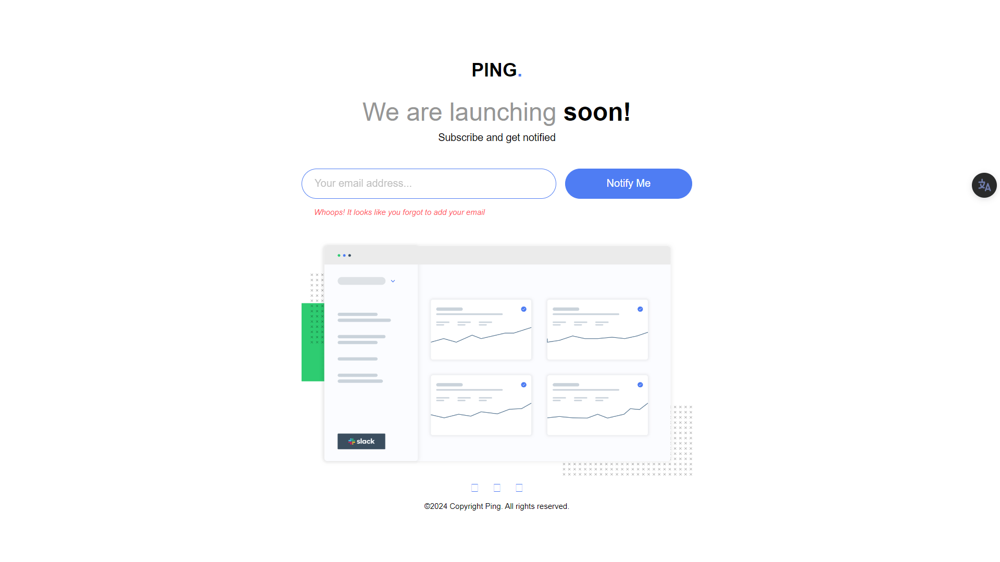

# Frontend Mentor - Ping coming soon page solution

This is a solution to the [Ping coming soon page challenge on Frontend Mentor](https://www.frontendmentor.io/challenges/ping-single-column-coming-soon-page-5cadd051fec04111f7b848da). Frontend Mentor challenges help you improve your coding skills by building realistic projects. 

## Table of contents

- [Overview](#overview)
  - [The challenge](#the-challenge)
  - [Screenshot](#screenshot)
  - [Links](#links)
- [My process](#my-process)
  - [Built with](#built-with)
  - [What I learned](#what-i-learned)
  - [Continued development](#continued-development)
- [Author](#author)

## Overview

### The challenge

Users should be able to:

- View the optimal layout for the site depending on their device's screen size
- See hover states for all interactive elements on the page
- Submit their email address using an `input` field
- Receive an error message when the `form` is submitted if:
	- The `input` field is empty. The message for this error should say *"Whoops! It looks like you forgot to add your email"*
	- The email address is not formatted correctly (i.e. a correct email address should have this structure: `name@host.tld`). The message for this error should say *"Please provide a valid email address"*

### Screenshot




### Links

- Solution URL: [Add solution URL here](https://your-solution-url.com)
- Live Site URL: [Add live site URL here](https://your-live-site-url.com)

## My process

### Built with

- Semantic HTML5 markup
- CSS custom properties
- Flexbox
- CSS Grid
- Mobile-first workflow
- [React](https://reactjs.org/) - JS library
- [Bootstrap](https://nextjs.org/) - React framework


### What I learned

I learned how to build a simple HTML form custom-validation with the React Library.

```jsx
const spanRef = useRef(null);
  const [placeholderText, setPlaceholder] = useState("Your email address...");

  function handleClick(e) {
    const form = e.target.form;

    function validateEmail() {
      const isEmailMissing = form[0].validity.valueMissing;
      const isEmailMismatch = form[0].validity.typeMismatch;

      if (isEmailMissing) {
        spanRef.current.style.display = "inline-block";
        spanRef.current.textContent =
          "Whoops! It looks like you forgot to add your email";
      } else if (isEmailMismatch) {
        spanRef.current.textContent = "Please provide a valid email address";
        spanRef.current.style.display = "inline-block";
        setPlaceholder("name@host.tld");
      } else if (!isEmailMissing && !isEmailMismatch) {
        spanRef.current.style.display = "none";
      }
    }

    if (!form.checkValidity()) {
      validateEmail();
      e.preventDefault();
    }
  }
```


### Continued development

I'd like to get better at React, particularly, Using recat hooks

## Author

- Website - [Kelechi Kizito Ugwu](https://www.your-site.com)
- Frontend Mentor - [@yourusername](https://www.frontendmentor.io/profile/yourusername)
- Twitter - [@kelechiikizito](https://www.x.com/kelechiikizito)
